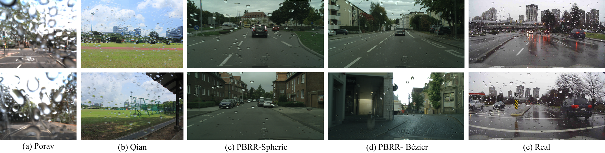

[< Back to Yunfei's home page](../index.html)

# <span style="color:darkred;">PBRR: </span> Physically Based Raindrop Rendering 

<font color=#777777 size=4 face="Calibri">Yunfei Liu<sup>1</sup>, Zhixiang Hao<sup>1</sup>, Shadi You<sup>3</sup>, Yu Li<sup>4</sup>, Feng Lu<sup>1</sup></font>

<font color=#777777 size=3 face="Calibri">1. Beihang University</font>

<font color=#777777 size=3 face="Calibri">2. University of Amsterdam</font>

<font color=#777777 size=3 face="Calibri">3. Tencent</font>

***PBRR*** is a large scale, public dataset for raindrop removal of photo-realistic adherent raindrop images based on [Cityscapes](https://www.cityscapes-dataset.com) dataset.  It contains two sub-dataset. In particular, the **PBRR-Spheric**  dataset  contains14875 data-samples using spherical  crown  mode; and the **PBRR-Bézier** dataset includes 14875 data-samples using Orthogonal Bezier Curve model. Each data sample contains images with 50-70 raindrops with various but realistic appearances, a ground truth raindrop mask, and a ground truth raindrop-less image.




**References**

1.  **Porav**,  H.,  Bruls,  T.,  Newman,  P.:  I  can  see  clearly  now:  Image restoration via de-raining.   *arXiv preprint arXiv:1901.00893*(2019)
2. **Qian**,  R.,  Tan,  R.T.,  Yang,  W.,  Su,  J.,  Liu,  J.:  Attentive  generative adversarial network for raindrop removal from a single image. In: *IEEE Conference on Computer Vision and Pattern Recognition*(2018)

## Citation

```latex
Coming soon!
```

## Download

Coming soon!

